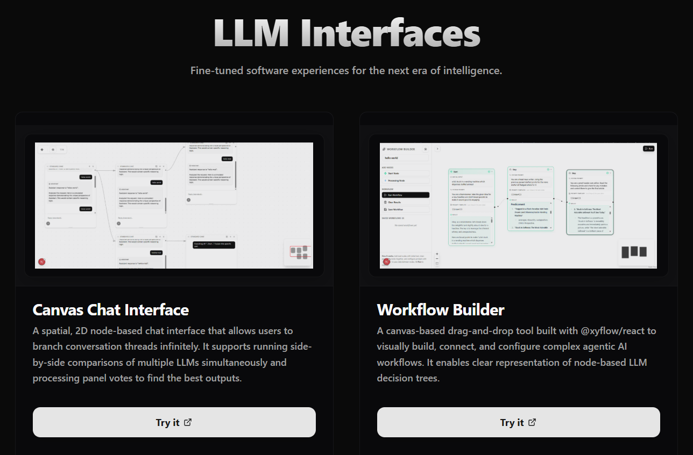
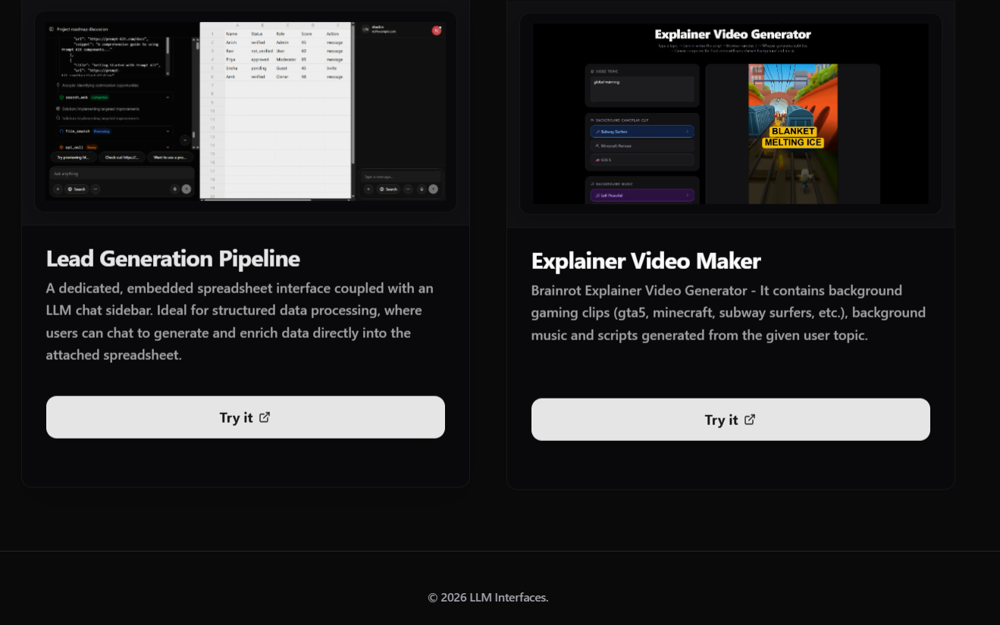
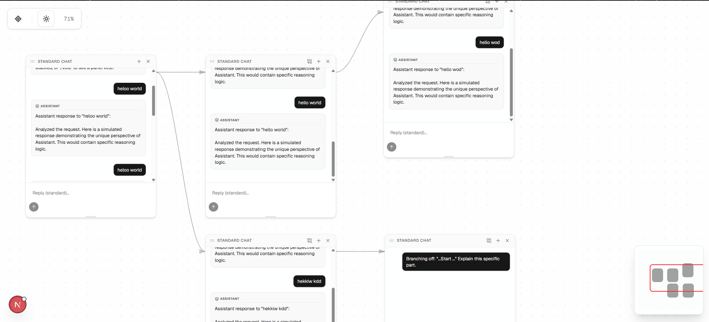
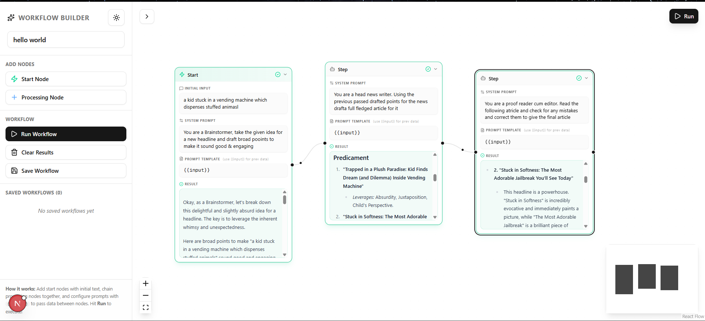
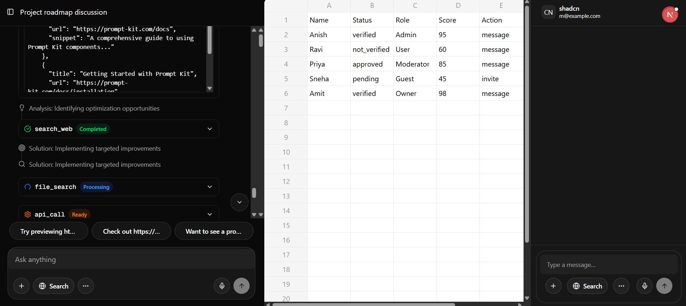
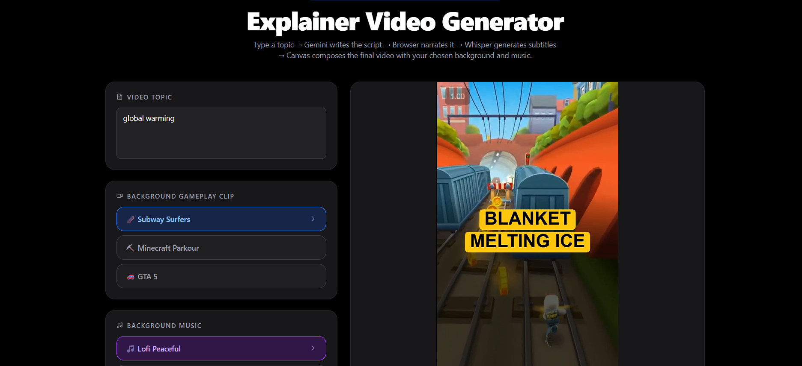

# LLM Interfaces

Fine-tuned software experiences for the next era of intelligence.





This repository contains a collection of advanced, specialized LLM interfaces designed to enhance productivity and creativity through tailored software experiences.

## Projects

### 1. Canvas Chat Interface
A spatial, 2D node-based chat interface that allows users to branch conversation threads infinitely.
- **Side-by-Side Comparison**: Run multiple LLMs simultaneously to compare outputs.
- **Panel Voting**: Intelligent processing to find the best response from different models.
- **Persistence & History**: Full `localStorage` persistence and 20-step undo/redo buffer.
- **Shortcuts**: Power-user keyboard shortcuts for rapid navigation.



### 2. Workflow Builder
A canvas-based drag-and-drop tool built with `@xyflow/react` to visually build, connect, and configure complex agentic AI workflows.
- **Custom Node Logic**: Configure individual LLM steps with specific system prompts and templates.
- **Condition Nodes**: Logic-based branching for autonomous decision trees.
- **Multi-Model Support**: Select different LLMs for specific nodes in the same workflow.
- **Auto-Tidy**: Intelligent layout engine to organize complex agentic maps.



### 3. Lead Generation Pipeline
A dedicated, embedded spreadsheet interface coupled with an LLM chat sidebar.
- **Structured Data Enrichment**: Use natural language to generate and enrich data directly into the attached spreadsheet.
- **Seamless Integration**: Perfect for mapping unstructured chat outputs into structured lead lists.



### 4. Explainer Video Maker
Brainrot Explainer Video Generator designed for viral social content creation.
- **Visual Assets**: Automatically integrates background gaming clips (GTA 5, Minecraft, Subway Surfers).
- **Audio & Scripts**: Generates synchronized scripts and background music based on user topics.



---

## 🛠️ Technology Stack

- **Framework**: Next.js (App Router)
- **Styling**: TailwindCSS & Shadow UI
- **Canvas Engines**: Custom Canvas implementation & `@xyflow/react`
- **Persistence**: `localStorage` & API-driven state management
- **Models**: Integration with Gemini 2.0, GPT-4o, Claude 3.5, and more.

## ⚙️ Setup

1. **Clone the repository**:
   ```bash
   git clone https://github.com/anishs1207/lead-gen-chat.git
   ```

2. **Install dependencies**:
   ```bash
   npm install
   ```

3. **Configure Environment**:
   Create a `.env` file in the root directory:
   ```env
   GEMINI_API_KEY=""
   GOOGLE_GENERATIVE_AI_API_KEY=""
   FIRECRAWL_API_KEY=""
   OPENROUTER_API_KEY=""
   ```

4. **Run development server**:
   ```bash
   npm run dev
   ```

---

&copy; 2026 LLM Interfaces.